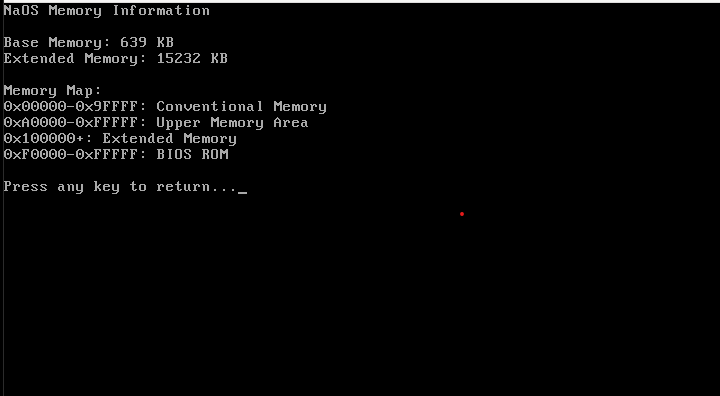

# Introduction to the OS

Hi, I'm Cirnik, the creator of this operating system.  
This OS was developed on **July 30, 2025**.

Let me introduce you to some of its features and architecture.

## Overview

This operating system is primarily written in **NASM (Netwide Assembler)** with small parts written in **C**.  
When the OS boots up, it launches the `boot` program. This acts both as a **user prompt** and a **command handler**.

### Boot Behavior

Upon startup:
- The system waits for user input.
- entering `tab` in prompt will display a list of all available files.
- Typing the name of a file **without** the `.bin` extension will **execute** that binary and perform the assigned action.

## Screenshots

  
Boot Screen

  

  
Executing `tab`

  

  
Executing `ascii.bin`

  

  
Executing `cpuid.bin`

  

  
Executing `credits.bin`

  

  
Executing `memory.bin`

  

  
Executing `ramdump.bin`

  

  
Executing system info

  

## Building the OS

To build the OS:

1. Use the provided `build.sh` script — it compiles everything into a single `.img` disk image(argument no/yes to build C code or no).
2. The final image will be located in the `/releases/` directory.

### Requirements

Make sure you have **GCC**(optional), **Python** and **NASM** installed in your development environment before building.

## Support Me

If you like my work, you can support me so that OS updates come faster :3

Via BTC: `bc1qfsepqwl9pqqfz3kzc3x9pt9qrhdrq7un2m3ydy`

